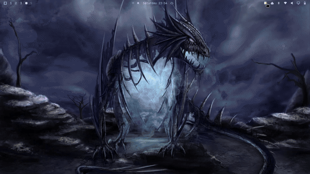

# quicksticky-notepad

Persistent multi-page scratch notepad for [Omarchy](https://omarchy.org/) —
markdown Text/Preview toggle, per-note colors, draggable/resizable overlay,
bar-widget launcher. Built as a Quickshell/QML plugin for `omarchy-shell`.




Full-quality recording: [`docs/images/quicksticky_demo.mp4`](docs/images/quicksticky_demo.mp4)

---

## Install

```bash
omarchy plugin add https://github.com/Syxball/quicksticky-notepad.git --enable
```

## Update

```bash
omarchy plugin update quicksticky.notepad
```

## Hotkeys

| Keys | Action |
|------|--------|
| `Alt` + `Arrows` | Move the window |
| `Alt` + `Shift` + `Arrows` | Resize the window |
| `Alt` + `0` | Reset window to the default centered size/position |

The title bar (drag) and the `◢` grip (bottom-right corner) do the same with the mouse.

## Documents

| File | Purpose |
|------|---------|
| `docs/CHANGELOG.md` | Full changelog — one entry per version |
| `docs/DOCUMENTATION.md` | User-facing guide — architecture and behavior |

---

## Version History

| Version | Date | Author | Notes |
|---------|------|--------|-------|
| 1.0.1 | 2026-08-30 | syxball | Renamed app title to Quick Sticky; added README screenshot and demo GIF |
| 1.0.0 | 2026-08-29 | syxball | First public release — quick-sticky-notes plugin |

_Full change history in [CHANGELOG.md](docs/CHANGELOG.md)._

---

## License

[MIT](LICENSE)
