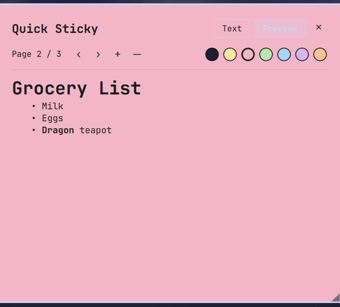

# quicksticky-notepad

Persistent multi-page scratch notepad for [Omarchy](https://omarchy.org/) —
markdown Text/Preview toggle, per-note colors, draggable/resizable overlay,
bar-widget launcher. Built as a Quickshell/QML plugin for `omarchy-shell`.



---

## Install

```bash
omarchy plugin add https://github.com/Syxball/quicksticky-notepad.git --enable
```

## Update

```bash
omarchy plugin update quicksticky.notepad
```

## Documents

| File | Purpose |
|------|---------|
| `docs/CHANGELOG.md` | Full changelog — one entry per version |
| `docs/DOCUMENTATION.md` | User-facing guide — architecture and behavior |

`docs/TODO.md` and `docs/RELEASE-CHECKLIST.md` are kept locally for personal
tracking and aren't part of this repo.

---

## Version History

Every version is listed here, including patches — this repo intentionally
breaks from the workspace default of showing minor/major only.

| Version | Date | Author | Notes |
|---------|------|--------|-------|
| 1.0.0 | 2026-08-29 | syxball | First public release — quick-sticky-notes plugin |

_Full change history in [CHANGELOG.md](docs/CHANGELOG.md)._

---

## License

[MIT](LICENSE)
